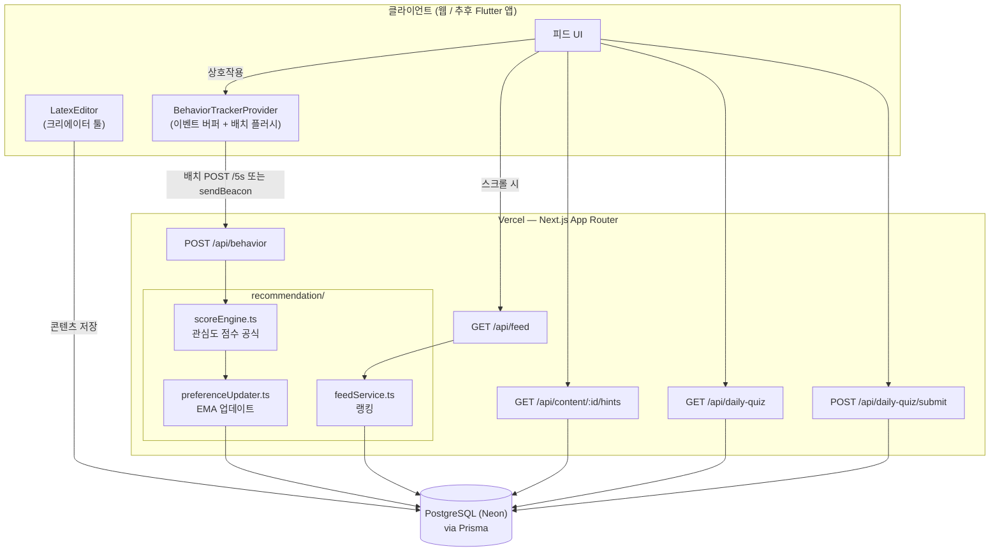
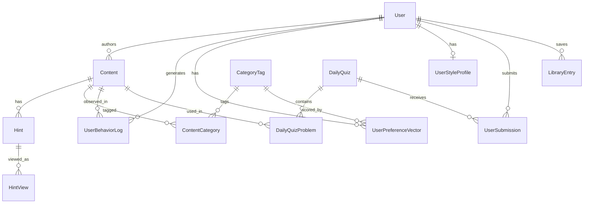

# 시스템 아키텍처 개요

## 배포 대상

Next.js App Router 단일 프로젝트를 Vercel(Fluid Compute, Node.js 런타임)에 배포하는 구조.
API 라우트가 백엔드 역할을 겸하므로 별도의 백엔드 서비스가 필요하지 않습니다
(콘텐츠/트래픽이 커지면 추천 서비스만 별도 서비스로 분리 가능하도록 `src/lib/recommendation`을
독립 모듈로 분리해 두었습니다).



## 추천 파이프라인

1. **수집** — `BehaviorTrackerProvider`가 뷰포트/스크롤/힌트/좋아요 등 원시 이벤트를 버퍼링,
   배치로 `/api/behavior`에 전송 ([이벤트 트래킹 프로토콜](event-tracking-protocol.md)).
2. **집계** — `aggregateSession()`이 원시 이벤트를 `UserBehaviorLog` 필드로 축약.
3. **채점** — `computeInterestScore()`:

   ```
   관심도 점수 = (실제 체류 시간 / 예상 소요 시간) × w1
              + (상호작용 수) × w2
              − (빠른 스킵 여부) × w3
   ```

   가중치는 `RANK_W1/W2/W3` 환경변수로 재배포 없이 튜닝 가능.
4. **선호도 갱신** — `applyPreferenceUpdate()`가 점수를 카테고리별 `UserPreferenceVector`
   (EMA)와 난이도 선호, 그리고 스타일 레이더(`UserStyleProfile`)에 반영.
5. **랭킹** — `getPersonalizedFeed()`가 최근 미노출 콘텐츠 후보군을 가져와
   `카테고리 친화도 − 난이도 격차² + 신선도 보너스 + 탐색 지터`로 정렬.

## 데이터 모델 개요

전체 필드는 [`prisma/schema.prisma`](../prisma/schema.prisma) 참고.



## 확장 지점

- **검색**: `Content.searchText` / `latexExpressions[]`는 지금은 평문 검색용이며,
  향후 pgvector(임베딩) 또는 OCR 파이프라인(이미지 → LaTeX → `latexExpressions`)로
  확장 가능하도록 별도 필드로 분리해 두었습니다.
- **인증**: 아직 미연결. `TODO(auth)`가 달린 지점(피드/행동/힌트/퀴즈 API)에서
  쿼리/바디의 `userId`를 세션 사용자로 교체하면 됩니다.
- **랭킹 확장**: 현재는 요청 시점 스코어링(비후보군 8배 오버패치 후 랭킹)이며,
  콘텐츠/사용자 수가 커지면 배치로 사전 계산된 랭킹 테이블이나 벡터 검색으로 이전 가능.
